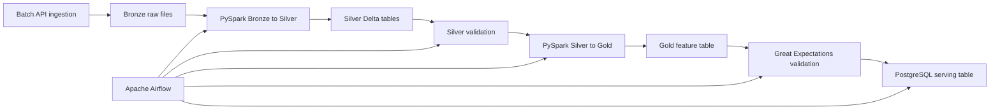

# AI Decision Platform

AI Decision Platform is an end-to-end data engineering project built around electricity consumption, weather and calendar data. The goal is to reproduce a realistic company-style data pipeline: ingest raw data, transform it into analytical layers, validate data quality, orchestrate the workflow and publish a clean business table for downstream analytics or machine learning.

This repository currently focuses on the data engineering foundation before the machine learning layer.

## Project goals

The project is designed to practice the core tools and patterns used in modern data teams:

- API data ingestion in batch mode
- Bronze, Silver and Gold data layers
- Spark transformations with PySpark
- Delta Lake tables and partitioned storage
- Data quality checks with Great Expectations
- PostgreSQL as a serving database
- Apache Airflow orchestration
- Docker-based local services
- Automated Python quality checks

## Current pipeline



The Airflow DAG runs the pipeline in this order:

```text
sync_project_dependencies
-> bronze_to_silver
-> validate_silver
-> silver_to_gold
-> validate_gold_gx
-> load_postgres
```

## Data layers

### Bronze

Bronze stores raw batch ingestion runs from external APIs. Each run has a manifest and keeps the data close to the source format.

### Silver

Silver stores cleaned and typed Delta tables:

- `rte_consumption`
- `weather_hourly`
- `calendar_daily`

This layer normalizes column names, casts types, removes duplicates and adds technical metadata such as run lineage.

### Gold

Gold contains the business-ready hourly feature table:

- `energy_features_hourly`

It combines electricity consumption, weather and calendar features into one table that can be used by analytics, dashboards, APIs or future ML models.

## Tech stack

| Area | Tools |
|---|---|
| Language | Python 3.12 |
| Dependency management | uv |
| Batch ingestion | Python, Polars |
| Distributed processing | PySpark |
| Lakehouse storage | Delta Lake |
| Data quality | Great Expectations |
| Serving database | PostgreSQL |
| Orchestration | Apache Airflow |
| Local infrastructure | Docker Compose |
| Quality checks | Ruff, Pytest, pre-commit |
| CI | GitHub Actions |

## Repository structure

```text
src/ai_decision_platform/
  ingestion/          Batch data ingestion
  processing/         Bronze -> Silver and Silver -> Gold transformations
  quality/            Great Expectations validation
  serving/            PostgreSQL loading

airflow/dags/         Airflow DAG definition
docker/airflow/       Custom Airflow Docker image
sql/                  SQL validation queries
scripts/              Local setup scripts
tests/                Unit tests
```

Generated data, local environments, logs and secrets are intentionally excluded from Git.

## Local setup

### Python setup

```bash
uv sync --frozen --extra dev
uv run --frozen ruff check .
uv run --frozen pytest
```

### Run batch ingestion

```bash
uv run --frozen python -m ai_decision_platform.ingestion.batch \
  --start 2024-01-01 \
  --end 2024-01-07
```

### Run Spark transformations manually from WSL

```bash
export UV_PROJECT_ENVIRONMENT="$HOME/.venvs/ia-decision-platform"
export UV_LINK_MODE=copy

uv run --frozen --extra spark python -m ai_decision_platform.processing.bronze_to_silver \
  --silver-dir "$HOME/ia-decision-platform-data/silver"

uv run --frozen --extra spark python -m ai_decision_platform.processing.validate_silver \
  --silver-dir "$HOME/ia-decision-platform-data/silver"

uv run --frozen --extra spark python -m ai_decision_platform.processing.silver_to_gold \
  --silver-dir "$HOME/ia-decision-platform-data/silver" \
  --gold-dir "$HOME/ia-decision-platform-data/gold"
```

### Validate Gold with Great Expectations

```bash
uv run --frozen --extra spark --extra quality python -m ai_decision_platform.quality.validate_gold_gx \
  --gold-dir "$HOME/ia-decision-platform-data/gold"
```

### Start PostgreSQL and load the serving table

```bash
docker compose up -d postgres

uv run --frozen --extra spark --extra serving python -m ai_decision_platform.serving.load_postgres \
  --gold-dir "$HOME/ia-decision-platform-data/gold"
```

Check the PostgreSQL table:

```bash
docker compose exec -T postgres psql -U adp -d adp < sql/check_energy_features_hourly.sql
```

## Run the full pipeline with Airflow

Build and start the local Airflow stack:

```bash
docker compose build airflow-init
docker compose up airflow-init
docker compose up -d postgres airflow-webserver airflow-scheduler
```

Open Airflow:

```text
http://localhost:8080
username: airflow
password: airflow
```

Trigger the DAG:

```bash
docker compose exec airflow-webserver airflow dags trigger energy_batch_pipeline
```

A successful run produces the Gold Delta table and loads the final result into PostgreSQL table:

```text
public.energy_features_hourly_postgres
```

## Validation status

The current pipeline has been executed successfully through Airflow with all tasks green:

```text
sync_project_dependencies
bronze_to_silver
validate_silver
silver_to_gold
validate_gold_gx
load_postgres
```

Local checks run before publication:

```text
ruff check: passed
pytest: 17 passed
```

## Next steps

Planned extensions:

- add dbt models on top of PostgreSQL
- add streaming ingestion with Kafka
- add ML training and experiment tracking with MLflow
- expose predictions through an API
- build a dashboard for business users
- add monitoring and alerting
